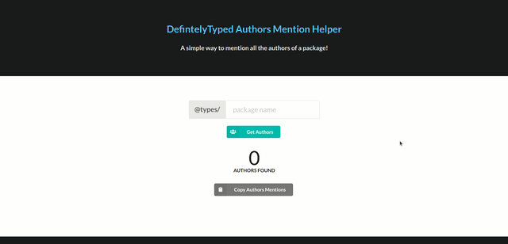

# DefinitelyTypedAuthorMention

A very simple page to help you get all the authors of a DefinitelyTyped package in github's mention format `@username`. :smiley:

## Why I made this page? :thinking:

The truth is I am very lazy. I wanted to mention all the authors of @types/mongoose to open an [issue](https://github.com/DefinitelyTyped/DefinitelyTyped/issues/38013). I found [too many authors](https://github.com/DefinitelyTyped/DefinitelyTyped/tree/master/types/mongoose/index.d.ts). I decided to copy all the text and write a [simple python script](https://gist.github.com/kerolloz/c920ec811648c7265ff64ddfd3a087c8) :nerd_face: to extract them from the source code. Five minutes later I found myself writing a simple webpage to do that. 👨‍💻

## How it works?

- The script downloads the code at the package's `index.d.ts` file.
  `https://raw.githubusercontent.com/DefinitelyTyped/DefinitelyTyped/master/types/${packageName}/index.d.ts`
- Extracts the definitions
  ```javascript
  /github.com\/(.*)>^/gm;
  ```
- Shows the authors mentions and lets you copy them.

## Demo


